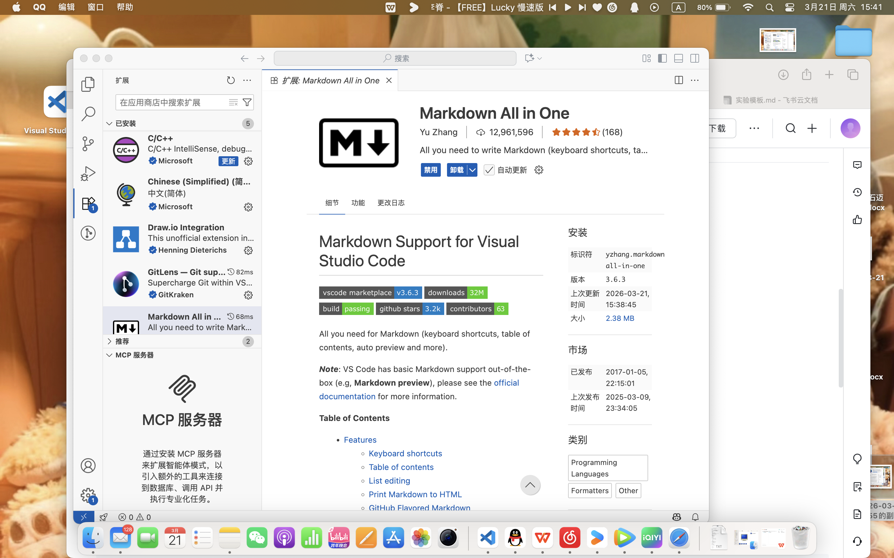
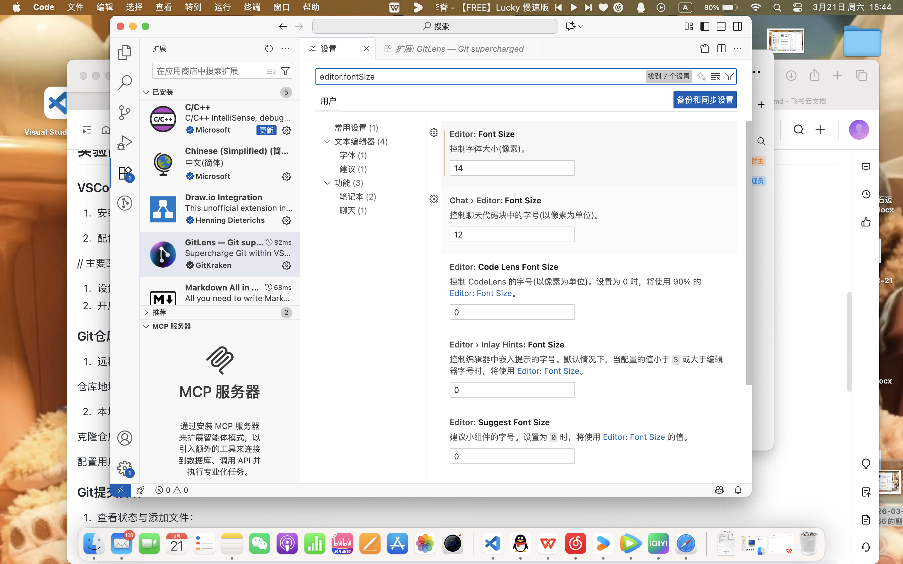
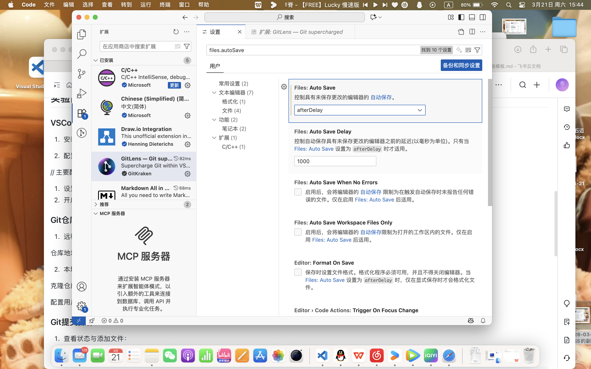
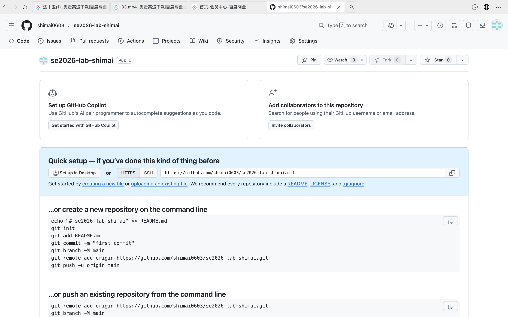
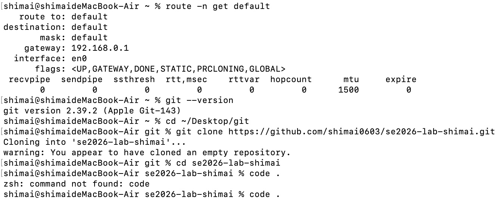
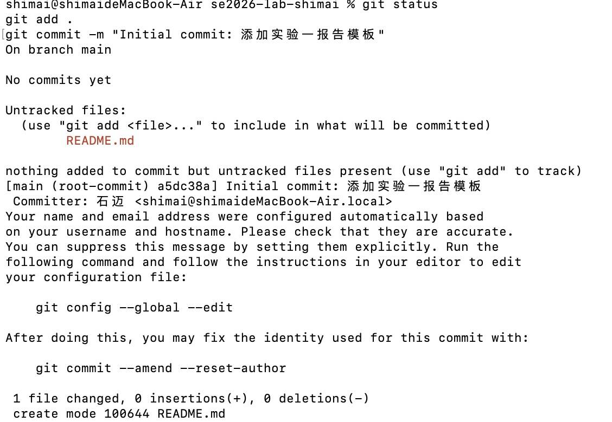
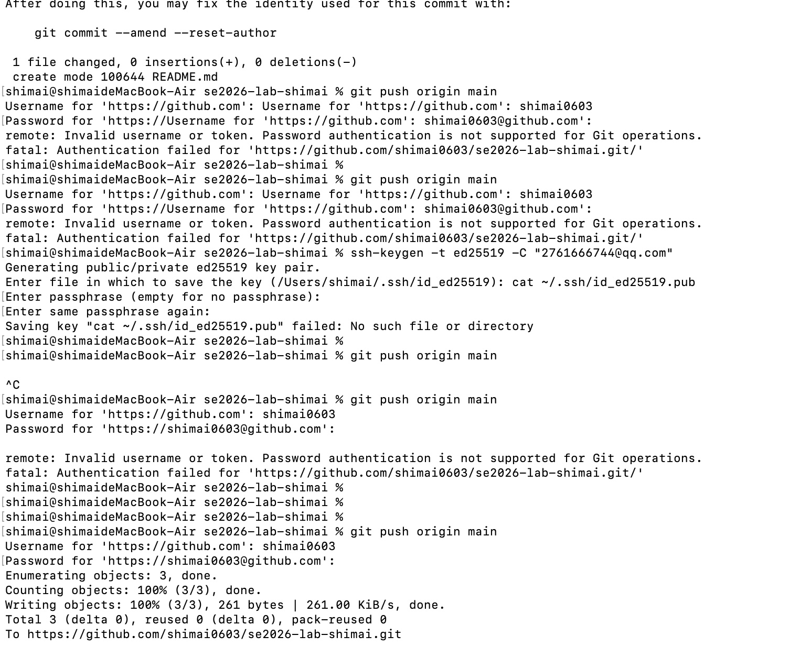
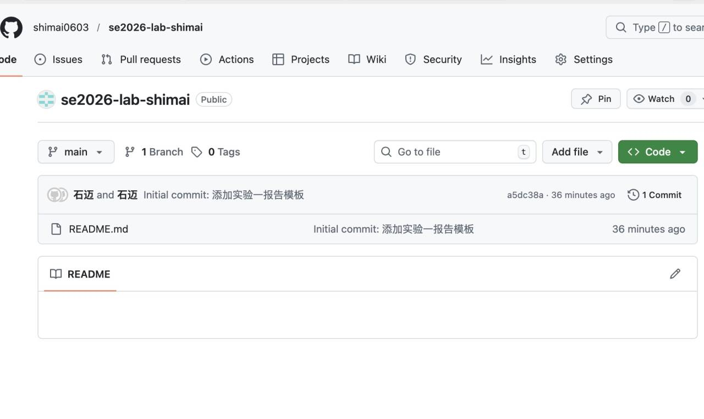

# 实验一：工欲善其事——开发环境搭建与版本控制入门

文档版本历史

| 版本 | 日期       | 修改人   | 修改内容                 |
| :--- | :--------- | :------- | :----------------------- |
| V1.0 | 2024-xx-xx | 学生姓名 | 初始版本创建             |
| V1.1 | 2024-xx-xx | 学生姓名 | 增加视频转播比分显示模块 |
| V1.2 | 2024-xx-xx | 学生姓名 | 增加赛程安排功能模块     |

## 实验信息
- **实验学时**：2学时
- **实验地点**：4403
- **合作者**：无

##  实验目的
- [ ] 掌握VSCode的安装及必要插件配置
- [ ] 掌握Git的基本操作（init, clone, add, commit, push, pull）
- [ ] 熟悉Markdown语法，能够编写结构化的文档

## 实验环境
- **操作系统**： macOS 
- **开发工具**：Visual Studio Code
- **版本控制**：Git (v____)
- **远程仓库**：GitHub 
- **VSCode插件列表**：
  - Markdown All in One
  - Draw.io Integration
  - GitLens

## 实验内容与步骤

### VSCode环境配置
1. 安装VSCode并配置插件（截图展示插件列表）：

    

2. 配置VSCode设置（如字体大小、自动保存等）：




// 主要配置项说明

1. 设置"editor.fontSize": 14
2. 开启"files.autoSave": "afterDelay"

###   Git仓库创建与克隆
1. 远程仓库创建（截图展示远程仓库页面）：

 

仓库地址：https://github.com/shimai0603/se2026-lab-shimai.git

2. 本地克隆与配置：

克隆仓库（ 命令及截图展示）
配置用户信息（ 命令及截图展示）

 


### Git提交操作

1. 查看状态与添加文件：

   bash

   ```
   git status
   git add .
   git commit -m "Initial commit: 添加实验一报告模板"
   ```

   

2. 提交记录截图：


3. 推送到远程仓库：

   bash

   ```
   git push origin main
   ```

   

## 实验结果与分析

### Git提交日志

bash

```
$ git log --oneline
 粘贴命令执行结果
```


### 远程仓库验证

- 登录远程仓库，确认文件已成功推送

- 截图验证：



## 遇到的问题及解决方法

| 问题描述                       | 解决方法                                               |
| :----------------------------- | :----------------------------------------------------- |
| git push时提示权限denied       | 在 GitHub 「Settings → Developer settings → Personal access tokens」中生成新的 PAT，勾选 repo 权限；推送时使用 PAT 作为密码进行 HTTPS 认证    |
| VSCode中Markdown预览不显示图片 | 检查图片路径，使用相对路径如`images/实验名/图片名.png` |

## 实验总结

- 本次实验掌握了VSCode+Git+Markdown的基本使用
- 学会了VSCode 环境配置、Markdown 图片插入、Git 版本控制，以及用 PAT 解决 GitHub 推送权限问题
- 不足之处：对 PAT 授权和图片路径配置的熟练度不足，需要多加练习

## 实验参考资料